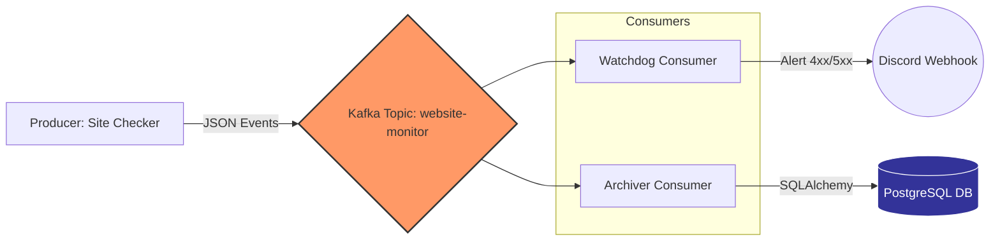

# Website Uptime Monitor

A lightweight uptime monitoring system using Kafka for real-time website health checks with Discord notifications and data archiving.

## Features

- Monitor multiple websites concurrently
- Real-time status checks with latency tracking
- Discord alerts for failures (4xx, 5xx, connection errors)
- Kafka-based event streaming architecture

## Tech Stack

* **Core:** Python 3.9+
* **Streaming:** Apache Kafka (Confluent Image)
* **Database:** PostgreSQL 15, SQLAlchemy (ORM)
* **Infrastructure:** Docker, Docker Compose
* **Testing:** Pytest, Unittest.mock
* **Utilities:** Discord Webhooks, Requests, Dotenv

## Architecture

The system follows a **Fan-Out Pattern** using Kafka Consumer Groups:



## Project Structure
```
uptime_monitor/
├── consumer/
│   ├── main.py              # Watchdog: Sends Discord alerts
│   └── consumer_db.py       # Archiver: Saves data to Postgres
├── producer/
│   └── main.py              # Checker: Pings sites & sends to Kafka
├── tests/
│   └── test_monitor.py      # Unit tests for business logic
├── config.py                # Centralized config loader
├── database.py              # SQLAlchemy DB setup & models
├── utils.py                 # Shared Kafka & Parsing utilities
├── docker-compose.yml       # Kafka + Postgres Infrastructure
└── requirements.txt         # Python dependencies
```

## Setup

1. Install dependencies:
```bash
pip install -r requirements.txt
```

2. Start Kafka Broker and PostgreSQL container in the background:
```bash
docker-compose up -d
```

3. Configure environment variables in `.env`:
```env
# Kafka Config
KAFKA_BOOTSTRAP_SERVERS=localhost:9092
KAFKA_TOPIC_NAME=website-monitor
KAFKA_GROUP_ID=monitor-consumer
SITES_TO_MONITOR=https://google.com,https://github.com
SLEEP_TIME=60
DISCORD_WEBHOOK_URL=your_webhook_url

# Database Config
DB_HOST=localhost
DB_NAME=uptime_db
DB_USER=admin
DB_PASS=password123
DB_PORT=5432
```

## Usage

Run the producer (monitors websites):
```bash
python producer/main.py
```

Run the alert consumer (sends alerts to Discord):
```bash
python consumer/main.py
```

Run the DB consumer (saves events to the database):
```bash
python consumer/consumer_db.py
```

## Testing

```bash
pytest -m pytest
```