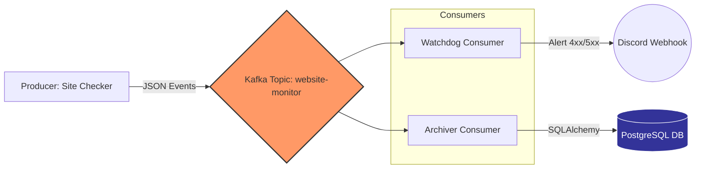

# Website Uptime Monitor

A lightweight uptime monitoring system using Kafka for real-time website health checks with Discord notifications and data archiving.

## Features

- Monitor multiple websites concurrently
- Real-time status checks with latency tracking
- Discord alerts for failures (4xx, 5xx, connection errors)
- Kafka-based event streaming architecture

## Tech Stack

* **Core:** Python 3.9+
* **Streaming:** Apache Kafka (Confluent Image)
* **Database:** PostgreSQL 15, SQLAlchemy (ORM)
* **Infrastructure:** Docker, Docker Compose
* **Testing:** Pytest, Unittest.mock
* **Utilities:** Discord Webhooks, Requests, Dotenv

## Architecture

The system follows a **Fan-Out Pattern** using Kafka Consumer Groups:



## Project Structure
```
uptime_monitor/
├── consumer/
│   ├── main.py              # Watchdog: Sends Discord alerts
│   └── consumer_db.py       # Archiver: Saves data to Postgres
├── producer/
│   └── main.py              # Checker: Pings sites & sends to Kafka
├── tests/
│   └── test_monitor.py      # Unit tests for business logic
├── config.py                # Centralized config loader
├── database.py              # SQLAlchemy DB setup & models
├── utils.py                 # Shared Kafka & Parsing utilities
├── Dockerfile               # Application container image
├── docker-compose.yml       # Full stack orchestration
├── .env.example             # Environment variables template
└── requirements.txt         # Python dependencies
```

## Quick Start (Docker)

### 1. Clone and Setup

```bash
# Clone the repository
git clone <your-repo-url>
cd uptime_monitor

# Create environment file
cp .env.example .env
```

### 2. Configure Discord Webhook

Edit `.env` and add your Discord webhook URL:

```bash
DISCORD_WEBHOOK_URL=https://discord.com/api/webhooks/your_webhook_url_here
```

Get a webhook URL from Discord: Server Settings → Integrations → Webhooks → New Webhook

### 3. Start All Services

```bash
# Build and start all containers
docker-compose up -d --build

# View logs (all services)
docker-compose logs -f

# View specific service logs
docker-compose logs -f producer
docker-compose logs -f consumer-alerts
docker-compose logs -f consumer-db
```

### 4. Verify Everything Works

```bash
# Check container status
docker-compose ps

# Check database for saved records
docker exec -it postgres_db psql -U admin -d uptime_db -c "SELECT * FROM website_stats ORDER BY created_at DESC LIMIT 10;"

# View Kafka topics
docker exec -it kafka kafka-topics --bootstrap-server localhost:29092 --list
```

### 5. Stop Services

```bash
# Stop all containers
docker-compose down

# Stop and remove volumes (clean slate)
docker-compose down -v
```

## Manual Setup (Local Development)

1. Install dependencies:
```bash
pip install -r requirements.txt
```

2. Start Kafka Broker and PostgreSQL container in the background:
```bash
docker-compose up -d kafka postgres
```

3. Configure environment variables in `.env`:
```env
# Kafka Config
KAFKA_BOOTSTRAP_SERVERS=localhost:9092
KAFKA_TOPIC_NAME=website-monitor
SITES_TO_MONITOR=https://google.com,https://github.com,https://httpbin.org/status/404,https://httpbin.org/status/503
SLEEP_TIME=60
DISCORD_WEBHOOK_URL=your_webhook_url

# Database Config
DB_HOST=localhost:5432
DB_NAME=uptime_db
DB_USER=admin
DB_PASS=password123
```

## Usage

Run the producer (monitors websites):
```bash
python producer/main.py
```

Run the alert consumer (sends alerts to Discord):
```bash
python consumer/main.py
```

Run the DB consumer (saves events to the database):
```bash
python consumer/consumer_db.py
```

## Configuration

### Monitored Websites

Edit `docker-compose.yml` to customize monitored sites:

```yaml
producer:
  environment:
    SITES_TO_MONITOR: https://google.com,https://github.com,https://yoursite.com
    SLEEP_TIME: 60  # Check interval in seconds
```

### Consumer Groups

Two independent consumer groups receive ALL messages:
- `alert_consumer_group` - Sends Discord notifications
- `db_consumer_group` - Saves to PostgreSQL

## Testing

```bash
# Run all tests
pytest

# Run with verbose output
pytest -v

# Run specific test file
pytest tests/test_monitor.py
```